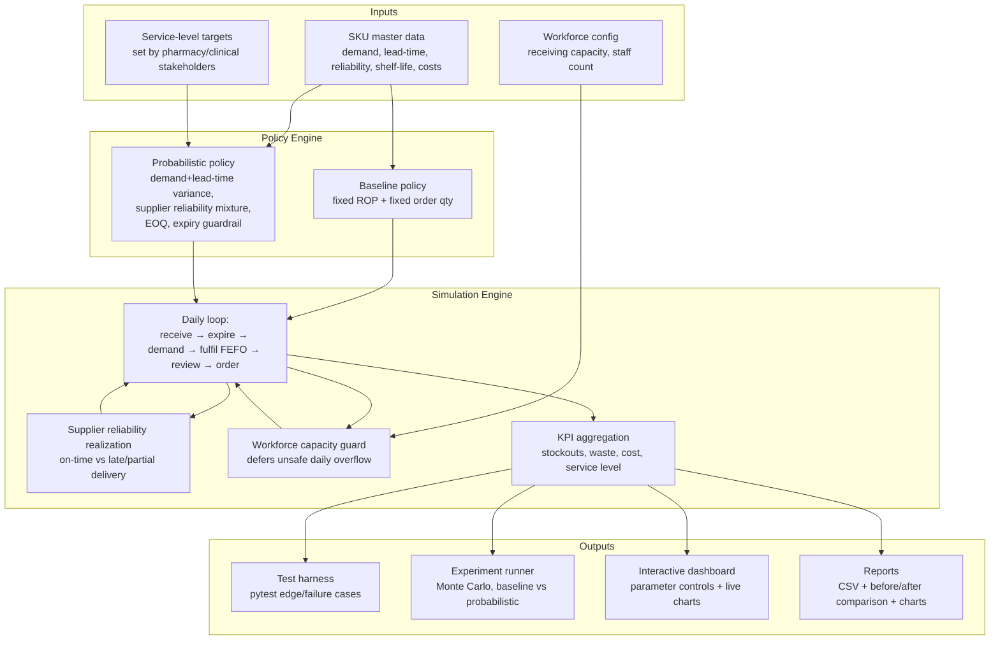

# Architecture

## System overview

## Component responsibilities

| Component | File | Responsibility |
|---|---|---|
| Data schema | `src/schema.py` | Defines `SKUConfig`, `WorkforceConfig`, `SimulationConfig` — the single source of truth for every input parameter. |
| Baseline policy | `src/policy_baseline.py` | Fixed reorder-point rule, mirrors the hospital's current practice (no variability/reliability awareness). |
| Probabilistic policy | `src/policy_probabilistic.py` | Computes reorder point + order-up-to level from demand/lead-time variance, a supplier-reliability mixture model, EOQ cost balancing, and an expiry guardrail. |
| Simulation engine | `src/simulation.py` | Day-stepped Monte Carlo simulator: FEFO batch consumption, expiry, stochastic unreliable deliveries, workforce-capacity-constrained receiving, cost/KPI tracking. |
| Test harness | `tests/test_edge_cases.py` | Pytest suite: policy-math correctness + 6 edge/failure-state scenarios (unreliable supplier, demand surge, near-zero reliability, workload overflow, expiry waste, zero-demand numerical stability). |
| Experiment runner | `experiments/run_experiment.py` | Runs the Monte Carlo comparison across a 6-SKU representative portfolio, producing CSVs, a comparison chart, and a before/after markdown report with 95% confidence intervals throughout (per-SKU and portfolio-wide headline reductions). |
| Demand distributions | `src/demand_distributions.py` | Samples daily demand under Normal (default), Poisson, Gamma, or Empirical (real historical log) shapes, for sensitivity analysis. |
| Sensitivity analysis | `experiments/run_sensitivity_analysis.py` | Re-runs representative SKUs under Poisson/Gamma/Empirical demand to confirm the probabilistic policy's advantage over baseline is not an artifact of assuming Normal demand. |
| Continuous integration | `.github/workflows/tests.yml` | Runs the full test harness, the main experiment, and the sensitivity analysis automatically on every push/PR, across Python 3.10-3.13. |
| Interactive interface | (artifact, see chat) | Lets a stakeholder adjust demand/lead-time/reliability/service-target parameters per SKU and immediately see baseline vs probabilistic stockouts, waste, cost, and service level, plus the same 3+ failure scenarios run live. |

## Why this architecture

- **Policy logic is separated from the simulation engine** so the same day-stepped simulator can score *any* policy (baseline, probabilistic, or a future third policy) on identical stochastic draws — this is what makes the before/after comparison fair and reproducible.
- **The reliability mixture model lives inside the policy, not the simulator**, so the policy's math is auditable independent of simulation noise (see `tests/test_edge_cases.py::TestPolicyMath`).
- **Workforce capacity is enforced inside the simulator**, not the policy, because it is a physical constraint on *receiving*, independent of how the order quantity was decided — this is what proves "efficiency is not gained through unsafe assignment" (a large order literally cannot be dumped on staff in one day; excess defers).
- **The interactive interface reimplements the identical policy formulas client-side** so stakeholders get instant feedback without needing the Python environment running — while the Python repository remains the audited, testable source of truth.
